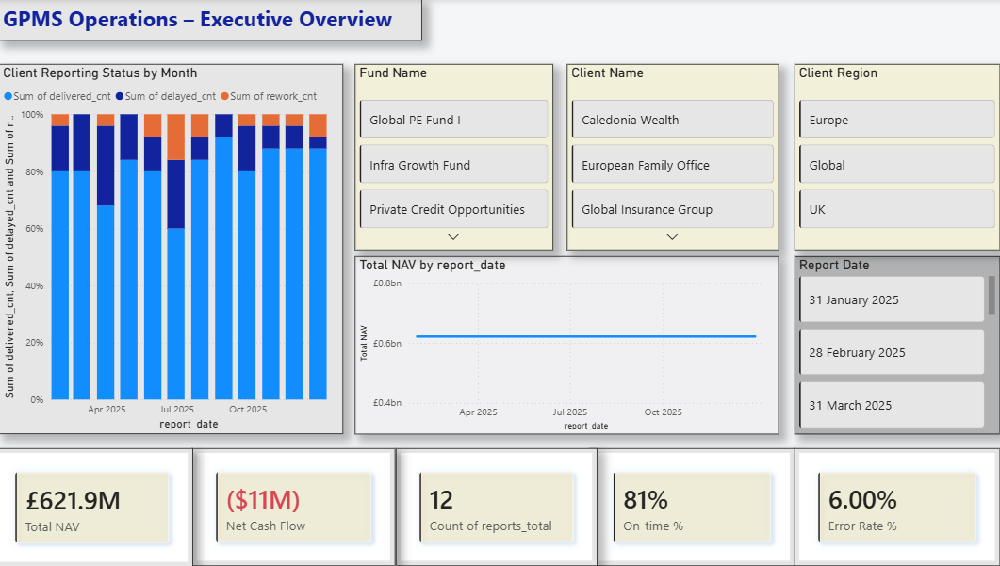
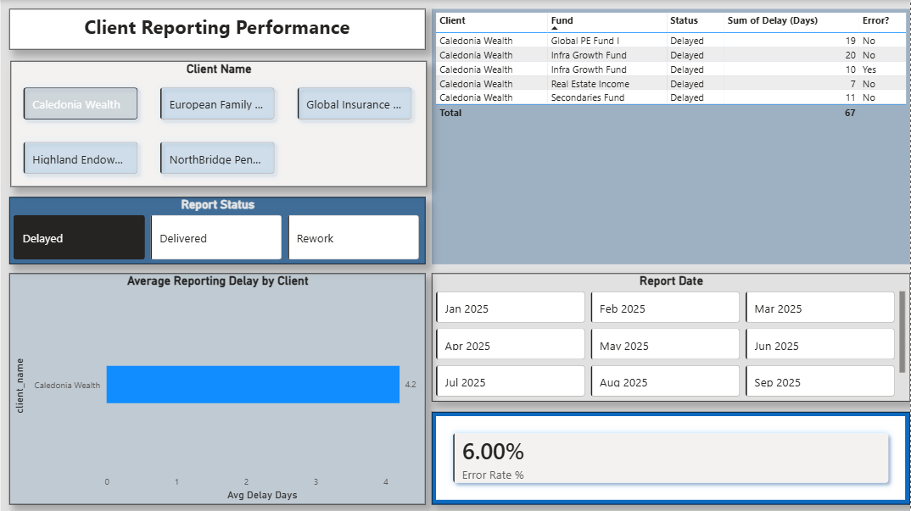

# GPMS Operations & Client Reporting Analytics

## Overview
This project simulates an operations and client reporting analytics solution for a private markets investment platform.
It focuses on monitoring reporting timeliness, data quality, and operational performance across clients and funds.

The dashboard is designed to support executive oversight and operational decision-making by highlighting delays, errors, and client-level risk.

---

## Key Features
- Executive overview of portfolio reporting performance
- Client-level drill-down for reporting delays and data quality issues
- Monthly reporting status distribution (Delivered / Delayed / Rework)
- Error Rate and On-time KPIs with slicer-driven interactivity
- Operational hotspot analysis to prioritise remediation

---

## Tools & Technologies
- **Power BI** – Data modelling, DAX measures, interactive dashboards
- **MySQL** – Data preparation, views, and aggregation logic
- **SQL** – Joins, aggregations, and operational reporting views
- **Excel / Power Query** – Data validation and transformation

---

## Dashboard Pages

### 1. Executive Overview
Provides a high-level view of:
- Total NAV
- Net Cash Flow
- Reporting volumes
- On-time delivery rate
- Error rate
- Monthly reporting status distribution

---

### 2. Client Reporting Performance
Enables operational drill-down to:
- Identify clients driving reporting delays
- Analyse average reporting delays by client
- Monitor data quality through error rate KPIs
- Filter by client, status, fund, region, and reporting month

---

### 3. Client-Level Drill-down
Demonstrates how slicers dynamically update KPIs and tables to support targeted operational action.

---

## Business Value
This dashboard enables operations and reporting teams to:
- Detect recurring reporting issues early
- Prioritise high-risk clients and funds
- Improve reporting timeliness and data quality
- Support scalable, governance-led reporting processes

---

## Author
**Eteka E. Bassey**  
Business Analyst | Commercial & Operations Analytics  
Edinburgh, Scotland  

LinkedIn: https://www.linkedin.com/in/eteka-bassey-638492266
